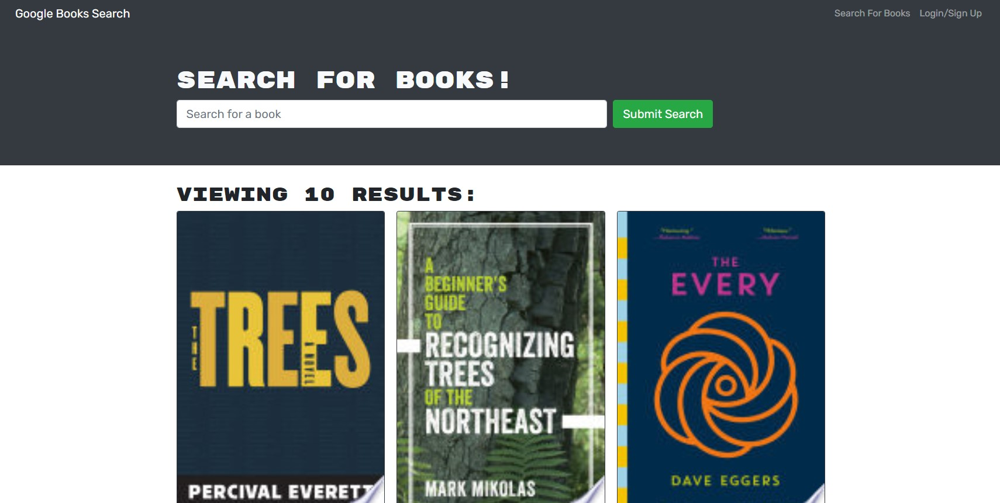

# book-search-engine

## Description 
This is an application built to search for books based on a search term. The search will display the book title, author, and a description. If users are logged in, they are able to then save books from their search for later viewing

Link to deployed application: :link: https://nameless-dawn-42206.herokuapp.com/
## Screenshot

## Table of Contents
* [License](#license)
* [Questions](#questions)

## License
🔗https://opensource.org/licenses/MIT

## Questions
Please reach out via email or GitHub with questions or issues.

🔗https://github.com/alexchristianson

📧alex.christianson.05@gmail.com
